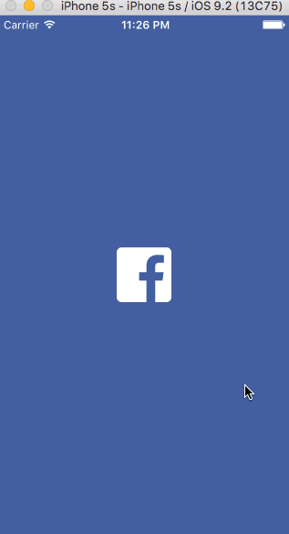

# CodePath Week 5 homework - Facebook 
A Facebook App Clone with photo view and custom transitions

This project submission is CodePath's week 5 homework of Facebook by Kevin Zhu

Time spent: 10 hours spent in total

 Completed project requirements:

*[x] Tapping on a photo in the news feed should expand the photo full screen.
*[x] Tapping the Done button should animate the photo back into its position in the news feed.
*[x] On scroll of the full screen photo, the background should start to become transparent, revealing the feed.
*[x] If the user scrolls a large amount and releases, the full screen photo should dismiss.
*[ ] Optional: The full screen photo should be zoomable.
*[ ] Optional: The user should be able to page through the other photos in full screen mode.

 
Notes:
Had a lot of issues with this week's homework. I spent many hours trying to pass through the correct photo to the next screen. 
The transition was complicated due to the FeedViewController being a subclass of the TabViewController. 
Had a lot of trouble figuring out the transition back. Kept getting error "fatal error: unexpectedly found nil while unwrapping an Optional value" 

GIF created with [LiceCap](http://www.cockos.com/licecap/).
